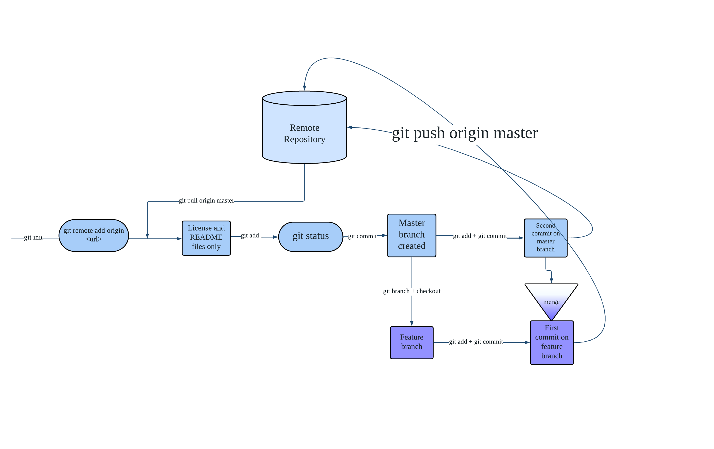

# Git Fundamentals Practice

## Summary of Skills and Concepts

* Creation and management of remote and local Git repositories
* Synchronization between local and remote repositories using Git commands
* Use of Git branches to work on independent changes
* Git commit operation to capture versions of your project
* Merging changes from one branch into another, handling potential conflicts
* Fundamental workflows in Git version control

## Git Trees and Merges Diagram

The diagram above provides a visual representation of how git trees and merges work. It illustrates the creation of a new branch, the independent changes made on each branch, and the final merge operation. The diagram helps in understanding the complex process of branching and merging in Git.

## Introduction

This project serves as a practice exercise for mastering the fundamentals of Git version control. The steps performed in this project range from creating remote and local repositories, establishing remote connections, manipulating branches, to performing merge operations.

## Git Operations Executed

### Creating a Remote Repository

The remote repository named tinyHiker/beginner_git_practice was created to serve as the central repository for the project.

### Initializing a Local Repository

A local repository was set up by executing the `git init` command. This initialized an empty repository on the local machine.

### Creating a Remote Connection

A remote connection named `origin` was established to link the local repository with the remote repository (tinyHiker/beginner_git_practice). This connection allows for synchronization between the local and remote repositories.

### Pulling License and README.md

Using the `git pull` command, the license and README.md file were retrieved from the remote repository and merged into the local repository. This ensured that the local repository was up to date with the remote repository.

### Creating a Script on the Main Branch

A script named `script.py` was created on the main branch of the local repository. The changes made to this file were committed, thereby capturing the initial version of the script.

### Creating a New Branch

A new branch named `first_branch` was created to work on independent changes. Switching to this branch allowed for separate development without affecting the main branch.

### Making Independent Changes on first_branch

Various changes and additions were made to the files on the `first_branch` branch. These changes were committed independently, creating a separate commit history on the branch.

### Switching Back to the Main Branch

Returning to the main branch (`master`), the independent changes made on `first_branch` were not visible. This is because the branches have separate commit histories.

### Creating a New File on the Main Branch

On the main branch, a new file was created to introduce additional functionality. This file was committed, capturing the changes made specifically on the main branch.

### Merging master into first_branch

Switching back to `first_branch`, the changes made on the main branch were merged into `first_branch`. This integration ensured that the new file from the main branch became visible on `first_branch`.

This project provides hands-on experience with common Git operations, such as creating repositories, initializing local repositories, setting up remote connections, branching, committing changes, and merging branches. By following these steps, you can practice and solidify your understanding of the fundamental concepts and workflows in Git version control.

